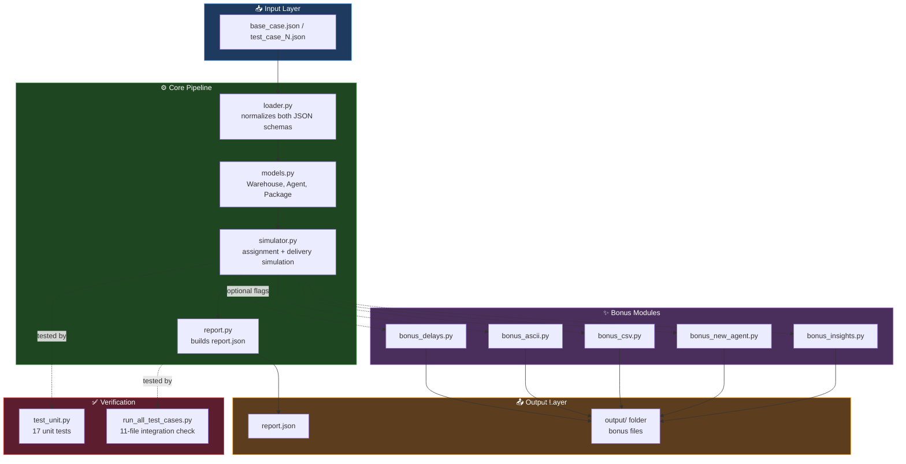
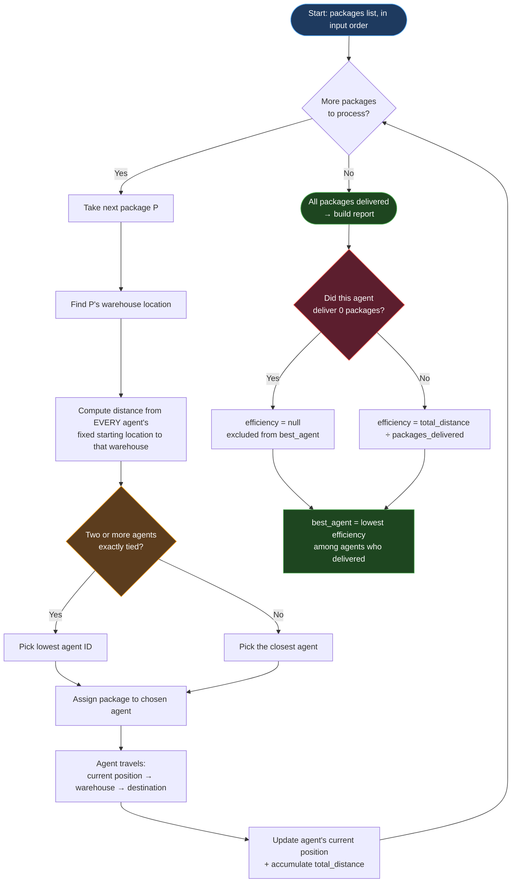
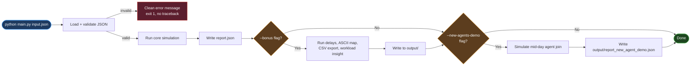

# FastBox Delivery Simulator

A Python simulator for FastBox's one-day delivery operations: assigns packages
to the nearest delivery agent, simulates each agent's route, and produces a
`report.json` summarizing packages delivered, distance traveled, and
efficiency per agent — plus the day's best-performing agent.

Built for the Nexgensis Technologies Python Developer assignment.

## Coverage against the evaluation criteria

| Criterion | Weight | Where |
|---|---|---|
| JSON parsing | 10% | `src/loader.py` — handles both input shapes present in the assignment, validates duplicates/bad references |
| Distance calculation | 20% | `src/models.py` — Euclidean (spec-required, default), pluggable via `--distance-metric` |
| Agent-package assignment | 25% | `src/simulator.py::nearest_agent_id` — fixed-position nearest match, documented tie-break |
| Simulation & report | 25% | `src/simulator.py::run_simulation` + `src/report.py` — cumulative path simulation, exact-schema `report.json`, zero-delivery edge case handled |
| Code clarity & comments | 10% | Every module opens with a docstring explaining *why*, not just what; assumptions are called out inline where the decision is made |
| Bonus creativity | 10% | All 4 requested bonuses + one uninvited extra (workload fairness insight) — see below |

## Architecture & Workflow

### 1. System Architecture — module structure

How the codebase is organized: input flows through the core pipeline,
bonus modules attach optionally without touching core logic, and two
separate test layers verify everything independently.



### 2. Algorithm Flow — how one package gets processed

The core decision logic per package: nearest-agent assignment (with a
documented tie-break rule), cumulative position simulation, and how
zero-delivery agents are handled safely in the final report.



### 3. CLI Decision Flow — what happens when you run main.py

Traces one CLI invocation end to end: validation, core report generation,
then two independent, sequential checks (--bonus, then --new-agents-demo)
— either, both, or neither can run, exactly matching main.py's two
separate `if` blocks.



## Quick start

```bash
# Core requirement: parse an input file and write report.json
python main.py data/base_case.json

# Same, but also run every bonus feature (delays, ASCII map, CSV, insight)
python main.py data/base_case.json --bonus

# Also demo an agent joining mid-day
python main.py data/base_case.json --bonus --new-agents-demo

# Try an alternate distance model (Euclidean is the default, per the spec)
python main.py data/base_case.json --distance-metric manhattan

# Run against any of the other shipped input files
python main.py data/test_cases/test_case_1.json --output output/tc1_report.json --bonus

# Run the integration check against all 11 provided input files
python tests/run_all_test_cases.py

# Run the unit tests
python -m unittest discover -s tests -v
```

No third-party dependencies — everything uses only the Python standard
library (`json`, `csv`, `random`, `argparse`, `dataclasses`, `statistics`,
`unittest`).

## Project layout

```
fastbox-delivery-system/
├── main.py                     # CLI entry point
├── report.json                 # required deliverable — output for data/base_case.json
├── src/
│   ├── models.py                # Warehouse / Agent / Package dataclasses + distance metrics
│   ├── loader.py                 # schema-flexible JSON loading & validation
│   ├── simulator.py               # core assignment + delivery simulation
│   ├── report.py                   # builds/writes the required report.json
│   ├── bonus_delays.py              # bonus: random delivery delays
│   ├── bonus_ascii.py                # bonus: ASCII map + route trace
│   ├── bonus_csv.py                   # bonus: CSV export of top performer
│   ├── bonus_new_agent.py              # bonus: agent joining mid-day
│   └── bonus_insights.py                # extra: workload fairness insight
├── data/
│   ├── base_case.json
│   └── test_cases/test_case_1.json ... test_case_10.json
├── tests/
│   ├── run_all_test_cases.py    # integration: runs & validates against all 11 input files
│   └── test_unit.py              # unit tests: distance fns, both schemas, edge cases
├── output/                       # generated reports, ASCII map, CSV, insight (created at runtime)
└── sample_output/                # committed snapshot of a real --bonus run, for browsing on GitHub
```

## How it works

1. **Load & normalize** (`loader.py`) — reads the input JSON and converts it
   into a common internal representation, regardless of which of the two
   input shapes it's written in (see Assumption 1 below).
2. **Assign** (`simulator.nearest_agent_id`) — for each package, finds the
   agent whose *starting* location is nearest (Euclidean distance) to the
   package's warehouse.
3. **Simulate** (`simulator.run_simulation`) — walks through packages in
   input order, moving each agent along a cumulative path
   (`current position → warehouse → destination`), accumulating distance.
4. **Report** (`report.py`) — formats `packages_delivered`, `total_distance`,
   `efficiency` per agent, plus `best_agent`, exactly matching the schema
   shown in the assignment PDF.

## Assumptions made (ambiguous/undefined scenarios)

The assignment explicitly asked us to resolve ambiguity ourselves and
document it rather than stop for clarification. Here's every judgment call:

1. **Two different input schemas.** The PDF's example `data.json` and all
   10 `test_case_*.json` files use `{"warehouses": {"W1": [x,y]}}` with
   packages keyed by `"warehouse"`. `base_case.json` instead uses
   `{"warehouses": [{"id": "W1", "location": [x,y]}]}` with packages keyed
   by `"warehouse_id"`. Rather than pick one, `loader.py` auto-detects and
   normalizes both, so the same code runs unmodified against every file in
   the assignment.

2. **No file is actually named `data.json`.** The PDF references that
   filename, but the shipped files are `base_case.json` / `test_case_N.json`.
   The script takes the input path as a CLI argument instead of hardcoding
   a filename.

3. **"Total distance traveled" is a cumulative simulated path**, not five
   independent point-to-point trips. Each agent starts at its initial
   location; for every package assigned to it (processed in input order) it
   travels `current position → warehouse → destination`, and that
   destination becomes its new current position for the next package. This
   matches the assignment's framing of "simulate one day of operations"
   more literally than resetting the agent to its start after every parcel.

4. **Assignment (nearest agent) uses each agent's fixed starting location**,
   not its evolving position during the day — this is what the PDF
   literally specifies ("Euclidean distance from agent to warehouse"), and
   keeping it decoupled from the (evolving) distance simulation avoids a
   chicken-and-egg problem where assignment order would affect who's
   "nearest."

5. **Tie-break rule:** if two or more agents are exactly equidistant from a
   warehouse, the agent with the lexicographically smaller ID is chosen.
   None of the 11 shipped input files actually produce a tie, but this
   guards against undefined behavior on inputs that do.

6. **Zero-delivery agents.** Every single one of the 10 test cases has at
   least one agent that receives zero packages (there are more
   agents/warehouses than the "3 of each" from the PDF's example in most
   files). For these agents, `efficiency` is `null` (can't divide by zero)
   and they're excluded from `best_agent` consideration. If *no* agent
   delivers anything, `best_agent` is `null`.

7. **`efficiency` = `total_distance / packages_delivered`** (average
   distance per delivery — lower is better). This is inferred from the
   PDF's sample report, where every agent's `efficiency` value exactly
   equals `total_distance / packages_delivered`. Note: the sample report's
   *absolute* numbers don't reconcile with the sample input's actual
   coordinates under any distance model we tested — it appears to exist
   to illustrate the JSON shape, not as a literal expected result, so we
   didn't try to reproduce it exactly, only the *formula* it implies.

8. **`best_agent`** = the agent with the lowest `efficiency` among agents
   who delivered at least one package (i.e., the best average
   distance-per-delivery, not simply the most packages or the least total
   distance — both of those are biased by how many packages an agent
   happened to get).

9. **Bonus — "mid-day agent joining"** has no defined input schema, so we
   added an optional, backward-compatible `"new_agents"` list to the input
   JSON: `[{"id": "A4", "location": [x, y], "joins_after_package": "P3"}]`.
   None of the shipped files use this, so normal runs are unaffected;
   `--new-agents-demo` demonstrates it by injecting one synthetically.

10. **Bonus — random delays** don't affect distance, assignment, or the
    required `report.json`; they're written to a separate
    `output/report_bonus.json` so the core deliverable's schema is never at
    risk. Delays are seeded (default `--seed 42`) for reproducible runs.

11. **Distance metric is pluggable, not hardcoded.** The spec asks for
    Euclidean distance and that's the default everywhere, but every
    distance-consuming function takes a `distance_fn` parameter (see
    `models.DISTANCE_METRICS`), exposed via `--distance-metric`. This was a
    design choice, not a requirement — it just means "distance" isn't
    baked into five different call sites as a literal formula.

## Bonus features implemented

| Feature | Where | Notes |
|---|---|---|
| Random delivery delays | `bonus_delays.py` | Seeded, 0–15 min/package, reported separately |
| ASCII route visualization | `bonus_ascii.py` | Scaled grid map + per-agent text trace |
| Mid-day agent joining | `bonus_new_agent.py` | Optional input schema extension, demoed via CLI flag |
| CSV export of top performer | `bonus_csv.py` | Exports `best_agent`'s stats to `output/top_performer.csv` |
| **Workload fairness insight** *(extra, beyond the 4 listed)* | `bonus_insights.py` | See below |

> **Note:** `sample_output/` contains a real, committed run of all bonus
> features (delay report, ASCII routes, CSV export, workload insight, the
> mid-day new-agent demo, and all 11 per-file test reports) so they're
> visible directly on GitHub without needing to run the code. `output/`
> itself is git-ignored and regenerated fresh on every local run —
> `sample_output/` is a labeled snapshot, not a build artifact.

**Why the workload insight exists:** while testing against all 10 provided
`test_case_*.json` files, I noticed *every single one* leaves at least one
agent with zero deliveries — meaning `best_agent` is sometimes "the best of
2 candidates," not 4 or 5. Rather than let that pass silently, `--bonus`
also writes `output/workload_insight.json` with idle-agent counts and a
one-line, data-driven summary. It's a genuine observation about this
dataset, not a generic "extra feature."

## Testing

Two layers:

- **`tests/test_unit.py`** — unit tests (stdlib `unittest`, no pytest
  required) for the actual logic decisions this project made: both input
  schemas normalize identically, the tie-break rule, zero-delivery handling
  (`efficiency: null`, excluded from `best_agent`), and that cumulative
  distance correctly uses each agent's *updated* position between legs.
  Run with `python -m unittest discover -s tests -v`.
- **`tests/run_all_test_cases.py`** — integration check across
  `base_case.json` and all 10 `test_case_*.json` files, asserting the core
  invariant from the PDF's notes — *"make sure total packages delivered
  matches total packages"* — for every one, and writing each file's
  individual report to `output/test_reports/`. All 11 pass.

Input validation (`loader.py`) also fails fast and clearly (non-zero exit,
readable error message) on missing files, malformed JSON, missing required
keys (including a package missing `destination`), non-numeric coordinates,
duplicate warehouse/agent/package IDs, and packages referencing a
nonexistent warehouse — rather than crashing with a raw traceback.
